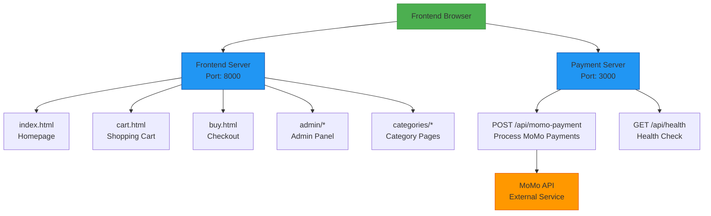

# Inzozi Shop Architecture

## System Components

## Data Flow

1. **Product Management**:
   - Admin uploads products via admin panel
   - Products stored in browser localStorage
   - All pages read product data from localStorage

2. **Shopping Experience**:
   - Users browse products by category
   - Products added to cart (stored in localStorage)
   - Users proceed to checkout (buy.html)

3. **Payment Processing**:
   - User selects MoMo payment option
   - Frontend sends payment request to backend server
   - Backend server processes payment with MoMo API
   - Response sent back to frontend
   - User receives payment confirmation

## Technologies

### Frontend
- HTML5
- CSS3 (with modern styling and animations)
- Vanilla JavaScript
- localStorage for data persistence

### Backend
- Node.js
- Express.js
- Axios for HTTP requests
- CORS for cross-origin requests

### External Services
- MoMo Payment API (integration ready)

## Security Considerations

- Admin authentication via simple credentials (localStorage)
- CORS configuration for API security
- Environment variables for sensitive data
- HTTPS recommended for production deployment

## Scalability

- Frontend is completely static (easy to deploy)
- Backend is stateless (can be scaled horizontally)
- localStorage limits data to individual browsers
- For production, consider using a database instead of localStorage